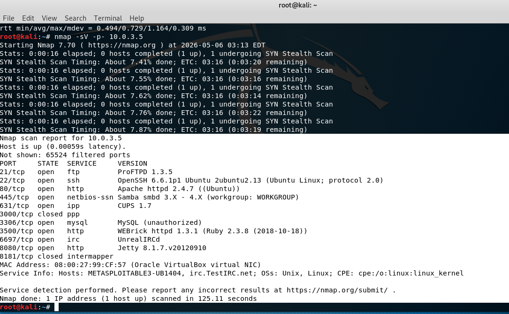

# Final Reprot
- Penetration Testing report
- content
  - What is Penetration test? What is red team?
  - Kali linux
  - Methodology ==> [PTES](http://www.pentest-standard.org/index.php/Main_Page) 15-20 pages
  - Important tools
    - nmap
    - searchsploit
    - metasploit framework
    - meterpreter
  - AD(Att&CK and Defense)1 : elasticsearch(Windows version)
  - AD(Att&CK and Defense)2 : YOUR Projects(Windows version)
  - AD(Att&CK and Defense)3 : YOUR Projects(Linux version) [see Reference](1_20260511_M3_Linux_AttackingFTPserver.md)
  - AD(Att&CK and Defense)4 : YOUR Projects(Linux version) [see Reference](2_20260511_M3_Linux_PrivilegeEscalation.md)
  - AD(Att&CK and Defense)5 : YOUR Projects(Linux version)
  - AD(Att&CK and Defense)6 :
  - AD(Att&CK and Defense)7 :  

# TWO images:
- M3 Windows server 2008 version
- M3 Linux version

# Tools
- metasploit framework ==> https://docs.metasploit.com/
- nmap
  - https://nmap.org/docs.html
  - https://nmap.org/book/man.html
  - Powerull NSE(Nmap Scripting Engine) ==> https://nmap.org/book/nse.html

# reference for you  
- There are two version: metasploitable3(Windows version) vs metasploitable3(Linux version)
- The stories are not the same ......

# M3 linux version ==> vagrant/vagrant

- Metasploitable3 Walkthrough
  - https://blog.securelayer7.net/metasploitable-3-walkthrough/
  - https://blog.securelayer7.net/metasploitable-3-walkthrough-part-2/ 

## Target machine ==> metasploitable3 windows server 2008
- findstr
- netstat -ano | findstr XXX
