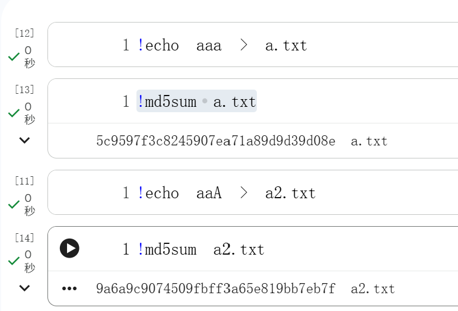
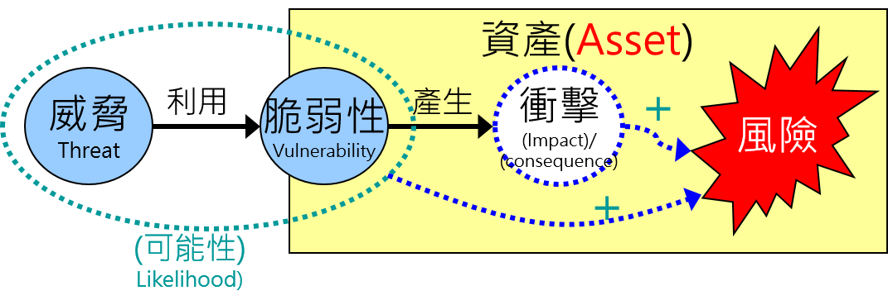

# Week 1: Introduction to Information Security
- The CIA Triad (Confidentiality, Integrity, Availability).
- Threats, Vulnerabilities, and Assets.
- Exercise ==> OWASP Security Principles 
  - https://devguide.owasp.org/en/02-foundations/03-security-principles/

## Using CTFs to Learn Cybersecurity
- Level up your Security Skills with CTFs
- CTF ==> 120.114.62.209
- CTF（Capture The Flag，奪旗賽）是一種流行的資訊安全競賽，參賽者透過解密、漏洞利用（Pwn）、逆向工程（Reverse）、Web 滲透、數位鑑識（Forensics）或雜項（Misc）等技術，從主辦方環境中找出特定的「Flag」字串來得分。
- 這是一種考驗技術、經驗與資安應用能力的駭客攻防競賽。
- 這是一種考驗技術、經驗與資安應用能力的駭客攻防競賽。

## The CIA Triad (Confidentiality, Integrity, Availability)
- Information Security Management Concepts:Core Objective: The CIA Triad
  - The primary goal of Information Security is to protect the Confidentiality, Integrity, and Availability of information.
- `1. Confidentiality(機密性)`
  - Definition: (1) Preventing unauthorized access to information, and (2) ensuring information remains secret.
  - Threat Scenarios:
    - Data access by unauthorized persons (internal threats or external hackers).
    - Leakage of sensitive business data or Personal Identifiable Information (PII).
  - Protection Methods:
    - Access Control
    - Encryption/Decryption Technologies
- `2. Integrity(完整性)`
  - Definition: (1) Preventing unauthorized modification of information, and (2) ensuring information accuracy.
  - Threat Scenarios:
    - Data tampering by unauthorized persons (internal threats or external hackers).
  - Protection Methods:
    - Access Control
    - Hash Functions | Digital Signatures
- `3. Availability(可用性)`
  - Definition: (1) Preventing system failure or malicious service disruption, and (2) ensuring information and processing resources are accessible when needed.
  - Threat Scenarios:
    - Malicious service disruption (e.g., DDoS attacks).
    - Ransomware encrypting files, making them inaccessible.
  - Protection Methods:
    - Access Control
    - Capacity Planning | Backups | Fault Tolerance | Redundancy | Load Balancing

## Hash function md5 ==> md5sum



## Recommended Readings
- https://devguide.owasp.org/en/02-foundations/01-security-fundamentals/


## Quiz: The CIA Triad Foundations: Multiple Choice
```
1. A technician accidentally deletes a critical configuration file, causing a web server to crash for three hours.
Which pillar of the CIA Triad has been violated?
A) Confidentiality
B) Integrity
C) Availability
D) Authenticity
```
```
2. Which of the following is a primary control used to ensure "Integrity"?
A) Hard drive encryption
B) Digital signatures and hashing
C) Off-site data backups
D) Complex password policies
```
```
3. An attacker uses a "packet sniffer" to intercept unencrypted credit card numbers being sent over a public Wi-Fi network.
This is a failure of:
A) Confidentiality
B) Integrity
C) Availability
D) Non-repudiation
```
## Threats, Vulnerabilities, and Assets ==> Risk management
- In the world of information security, the relationship between Assets, Vulnerabilities, and Threats forms the foundation of risk management.
- Understanding how these three elements interact allows you to move from "feeling" insecure to "measuring" risk.
#### The Core Definitions
- Think of these three components as the "Why," "How," and "What" of security
- Asset
  - Anything of value to the organization that must be protected.
  - Data (PII), Hardware, Reputation, Intellectual Property.
- Vulnerability
  - A weakness or flaw in an asset or its defense mechanism.
  - Unpatched software, weak passwords, lack of encryption.
- Threat
  - A potential cause of an unwanted incident that may harm an asset.
  - Hackers, Malware, Natural disasters, Insider threats.

#### The Relationship (The Risk Equation)
- Security professionals often use a conceptual formula to show how these elements create Risk

    $$Risk = Assets \times Threats \times Vulnerabilities$$



- No Vulnerability? Even if a threat exists (a hacker), there is no risk if there is no way in.
- No Threat? Even if a system is weak, there is no risk if no one or nothing can exploit it.
- No Asset? If the system has no value, the risk is irrelevant.

#### Real-World Scenario:Web Application
- To put this into a practical context (like a blog project or a corporate database)
- Asset: The user database containing emails and hashed passwords.
- Vulnerability: A SQL injection flaw in the login form.
- Threat: A malicious actor using automated scripts(SQLMAP) to find exploitable forms.
- Risk: The unauthorized disclosure of user data, leading to legal fines and loss of trust.

## Mitigation Strategies
- Once you identify these three, you apply Controls to break the link
- To address Vulnerabilities: Use "Hardening" (patching software, closing ports).
- To address Threats: Use "Deterrence" or "Detection" (Firewalls, IDS/IPS, physical security).
- To address Assets: Use "Data Loss Prevention" (Encryption, Backups).
#### Practice Quiz: 
```
1. Which of the following is an example of an "Asset" in a software development project?
A) A SQL injection flaw in the login page.
B) A hacker attempting to brute-force a password.
C) The proprietary source code stored in a private repository.
D) A natural disaster like a flood.
```
```
2. A "Vulnerability" is best described as:
A) A potential cause of an unwanted incident.
B) A weakness or flaw in a system's defense.
C) The financial value of a company's server.
D) A proactive measure to stop an attack.
```
```
3. If a company has a highly valuable database (Asset) and is targeted by professional hackers (Threat),
but the database is completely disconnected from any network and encrypted (No Vulnerability), what is the "Risk" level?
A) Critical
B) High
C) Moderate
D) Low/Negligible
```
## That's all for today, as I have a school meeting shortly.
- I have a school meeting this Wednesday, so our class time will be changed to 11:10–13:00.
- We’ll make up the rest of the hours later on. 
